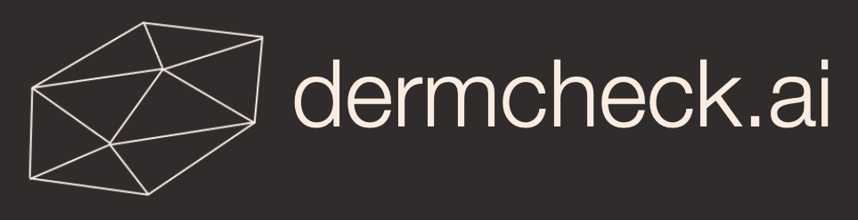

# W210 Data Science Capstone
## dermcheck.ai
#### By: Ruby Han, George Jiang, Gerrit Lensink, Shivani Sharma

## Abstract
According to the National Institute of Health, skin conditions are one of the most prevalent ailments in America, affecting one in three people at any given time. However, the varying degrees of severity leave many prospective patients wondering if they require physician consultation, or if they would be able to carry on without a costly trip to the doctor’s office.

The goal of dermcheck.ai is to create a mobile app that could classify different user-submitted skin images to their nearest category of diagnosis, using an ensemble model, in which we combine prediction from a multitude of deep learning abnormality detection models. Users should be able to use the mobile app to diagnose and reduce the amount of money and time spent at doctors offices, and detect possible life-threatening markings that should motivate a trip to their physician. 

Please see [google drive folder](https://drive.google.com/drive/folders/1oLqejM9KnDiIgUupEGkxGM3_vdqboxlI?usp=sharing) for datasets, codes, model checkpoints and etc. for items not found in current GitHub Repo.

Checkout our Berkeley's [project summary page](https://www.ischool.berkeley.edu/projects/2022/dermcheckai) and [website](https://gerritlensink.wixsite.com/dermcheck-ai)!